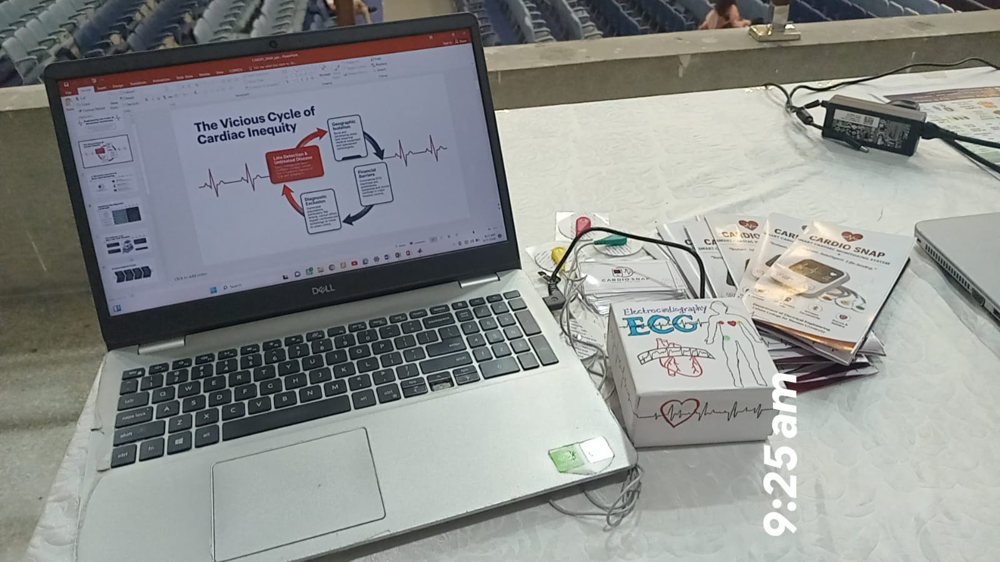
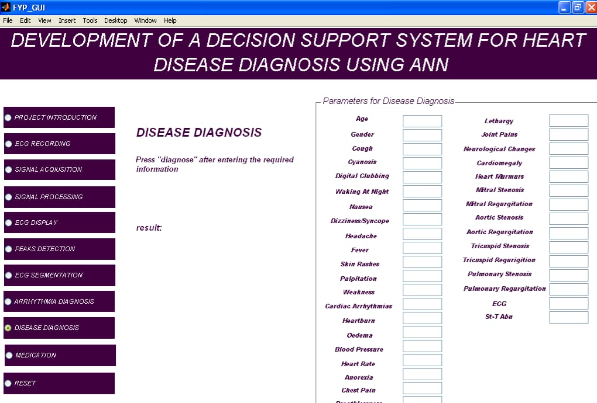
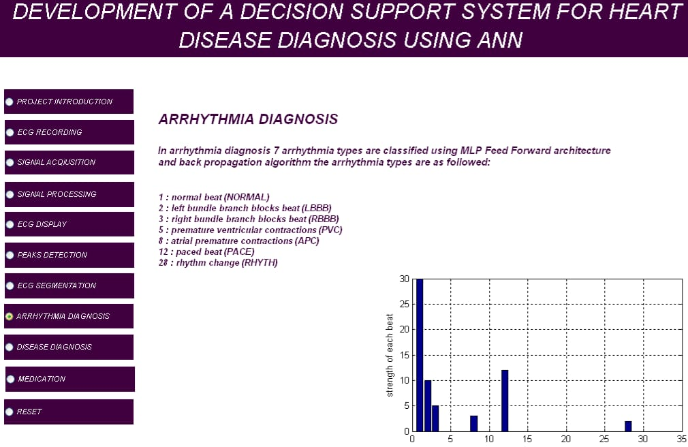
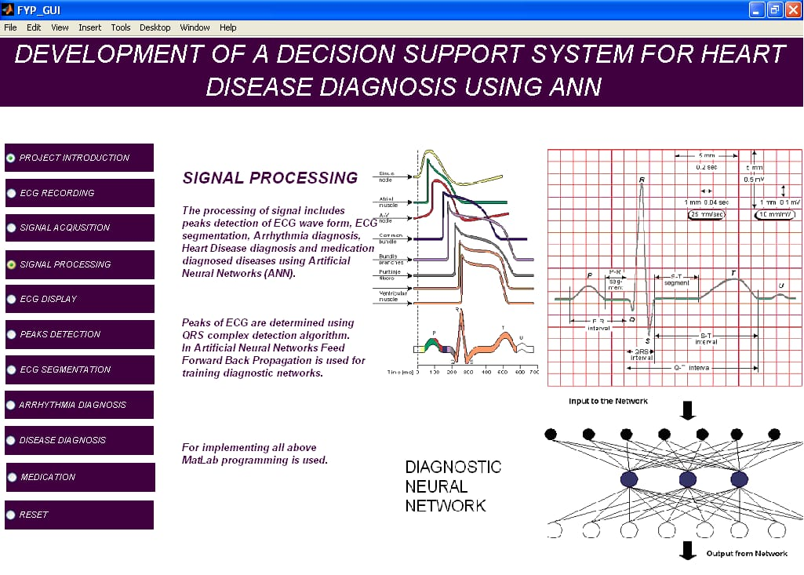
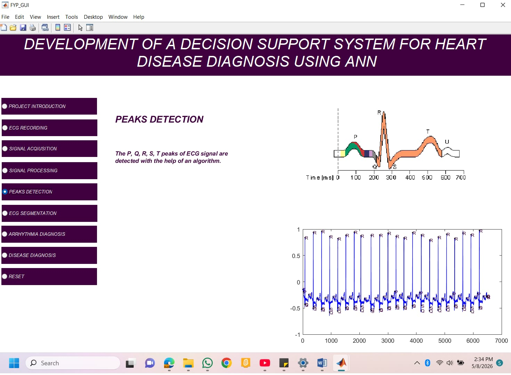
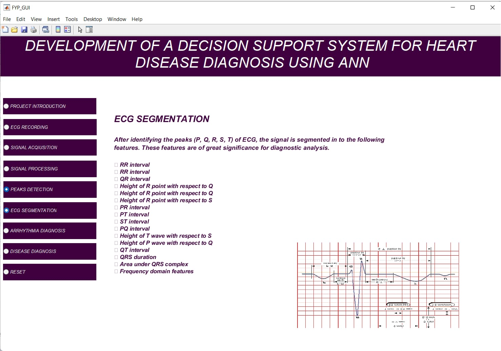

## Overview

The **AI-Based ECG Decision Support System** is a MATLAB-based biomedical signal processing project developed to assist in heart disease diagnosis using **Electrocardiogram (ECG) signals** and **Artificial Neural Networks (ANN)**.

The system performs ECG signal analysis, feature extraction, arrhythmia classification, and disease prediction through computational intelligence techniques.

This project demonstrates the application of **Electrical and Computer Engineering concepts, digital signal processing, and artificial intelligence in healthcare technology**.

---

# Project Objectives

- Analyze ECG signals for cardiac abnormality detection
- Process ECG waveforms using digital signal processing techniques
- Detect important ECG features including P-Q-R-S-T waves
- Perform ECG segmentation and feature extraction
- Apply Artificial Neural Networks for disease classification
- Develop a decision support system for cardiac diagnosis

---

# Technologies Used

- MATLAB
- Digital Signal Processing (DSP)
- Artificial Neural Networks (ANN)
- Biomedical Signal Processing
- ECG Signal Analysis

---

# System Workflow

The system consists of the following modules:

## 1. ECG Signal Acquisition

ECG signals are collected and prepared for computational analysis.

## 2. Signal Processing

The acquired ECG signals are processed to remove noise and improve signal quality.

## 3. Peak Detection

Important ECG waveform components are detected:

- P wave
- Q wave
- R peak
- S wave
- T wave

## 4. ECG Segmentation

Features are extracted from ECG signals including:

- RR interval
- PR interval
- QT interval
- QRS duration
- Frequency domain features

## 5. Arrhythmia Diagnosis

The system classifies different ECG patterns using ANN techniques.

Examples include:

- Normal Beat
- Left Bundle Branch Block (LBBB)
- Right Bundle Branch Block (RBBB)
- Premature Ventricular Contraction (PVC)
- Atrial Premature Contraction (APC)
- Paced Beat
- Rhythm Changes

## 6. Disease Diagnosis

The developed decision support system provides assistance in identifying cardiac abnormalities based on ECG parameters.

---

# My Role

I worked as a **Co-Founder and Project Representative** for this project.

My contributions included:

- Project presentation and demonstration
- System explanation and technical documentation
- Understanding ECG signal processing workflow
- Explaining ANN-based diagnostic methodology
- Representing the project at technical exhibitions

The MATLAB implementation was developed under faculty supervision.

---

# Project Achievement

🏆 **Domain Specific Winner — Project Exhibition**

The project received recognition and a cash award of **PKR 5000** for demonstrating an AI-based ECG disease diagnosis system.

---
# Project Screenshots

## Project Setup

---

## ECG Diagnosis Interface

---

## Arrhythmia Diagnosis

---

## Signal Processing

---

## ECG Peak Detection

---

## ECG Segmentation

---

## Expo Achievement

# Demo Video

Click below to watch the project demonstration:

[View Demo Video](Presentation/demo.mp4)
# Future Improvements

Possible future enhancements:

- Real-time ECG monitoring
- Deep learning-based classification
- Mobile application integration
- Cloud-based healthcare analytics
- Improved prediction accuracy using larger datasets

---

# Disclaimer

This repository contains project documentation, screenshots, and demonstrations.

The MATLAB source implementation was developed under academic supervision and is not included in this repository.
